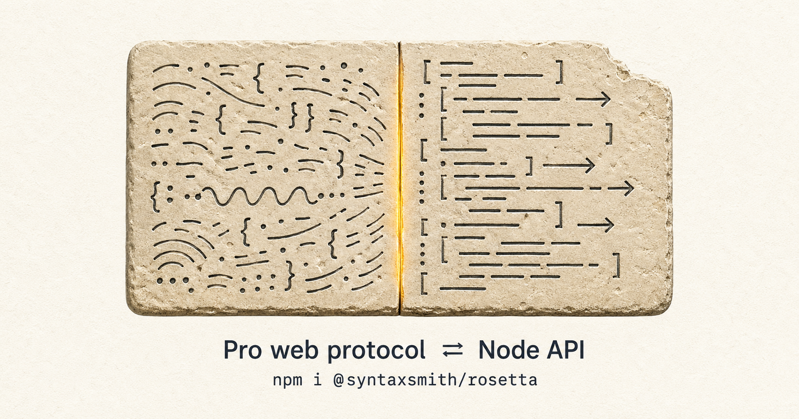

# rosetta

<p align="center">
  
</p>

Programmatic access to **ChatGPT (incl. Pro)** from Node, by translating between an auth-holder Chrome page and a clean API. 

> Like the Rosetta Stone: the Pro web protocol on one side, a regular Node API on the other.

## What it does

- **Pro support**: `runConversation({ model: "gpt-5-5-pro", ... })` follows the `stream_handoff` event, opens the WebSocket second leg, and aggregates the live CoT until `message_stream_complete` — same UX as the chatgpt.com UI but returnable from Node.
- **Instant models too**: `gpt-5-3` (or whatever current "instant" slug) returns in seconds via the same path.
- **Multi-turn**: pass `conversationId` + `parentMessageId` (or use `recall: "thread"` for persistence).
- **Concurrency**: each call spawns its own tab; many calls can stream in parallel.
- **Live token deltas**: optional `onChunk(delta)` callback streams the CoT as it arrives.
- **Idle-timeout watchdog**: long thinks (15 min+) keep going as long as the WS sends heartbeats; only true silence kills the call.

## Install

```bash
pnpm add @syntaxsmith/rosetta
# or
npm i @syntaxsmith/rosetta
```

Requires Node ≥ 22.

## Setup: launch Chrome

You need a Chrome with `--remote-debugging-port` open and **logged in to chatgpt.com once**. Profile is reused across runs.

### Linux

```bash
chromium \
  --remote-debugging-port=9222 \
  --user-data-dir=$HOME/.rosetta/profile \
  --no-first-run --no-default-browser-check \
  https://chatgpt.com/
```

### macOS

```bash
"/Applications/Google Chrome.app/Contents/MacOS/Google Chrome" \
  --remote-debugging-port=9222 \
  --user-data-dir=$HOME/.rosetta/profile \
  --no-first-run --no-default-browser-check \
  https://chatgpt.com/
```

### Windows (PowerShell)

```powershell
& "C:\Program Files\Google\Chrome\Application\chrome.exe" `
  --remote-debugging-port=9222 `
  --user-data-dir=$env:USERPROFILE\.rosetta\profile `
  --no-first-run --no-default-browser-check `
  https://chatgpt.com/
```

Sign in once; the profile persists. Subsequent runs reuse the cookies.

## CLI

```bash
# instant model
rosetta run "Reply with the single word: pong"

# Pro thinking
rosetta run --pro "Explain idempotent matrices in three sentences."

# stream live tokens
rosetta run --pro --stream "Sketch a 3-paragraph plan for X"

# threaded recall — successive calls build on the same conversation
rosetta run --recall research "what's the prior on Y?"
rosetta run --recall research "given that, what would change?"

# inspect / clear persisted threads
rosetta threads
rosetta forget research

# list models the account exposes
rosetta probe

# attach a local file (repeatable) — image, PDF, CSV, code, ...
rosetta run --attach photo.png "What's in this image?"
rosetta run --pro --attach report.pdf "Quote the third paragraph verbatim."
rosetta run --attach a.csv --attach b.csv "Merge these and find duplicates."
```

Common flags: `--port <n>` (default 9222), `--host <h>` (default 127.0.0.1), `--model <slug>`.

## Programmatic API

```ts
import { openSession, runConversation } from "@syntaxsmith/rosetta";

const session = await openSession({ port: 9222 });

// One-shot
const result = await runConversation(session, {
  prompt: "What's the area of a triangle with sides 3, 4, 5?",
  model: "gpt-5-5-pro",        // Pro
});
console.log(result.text);       // "6"
console.log(result.modelSlug);  // "gpt-5-5-pro"
console.log(result.tookMs);     // ~30000 for trivial prompts

// Streaming
await runConversation(
  session,
  { prompt: "...", model: "gpt-5-5-pro" },
  { onChunk: (delta) => process.stdout.write(delta) },
);

// Multi-turn via persistent recall thread
await runConversation(
  session,
  { prompt: "Remember the token BANANA-77.", model: "gpt-5-3", recall: "demo" },
);
const r2 = await runConversation(
  session,
  { prompt: "What was the token I asked you to remember?", model: "gpt-5-3", recall: "demo" },
);
// r2.text === "BANANA-77"

// File attachments — same UX as drag-dropping in the web composer.
// Each file is fed into ChatGPT's hidden file input via DataTransfer
// and the page's React pipeline handles the rest. 20 MB per-file cap.
const r3 = await runConversation(session, {
  prompt: "What color is this image?",
  model: "gpt-5-3",
  attachments: [{ path: "./fixtures/red-square.png" }],
});

// Multiple files (sequential, fail-fast) + Pro for harder tasks.
await runConversation(session, {
  prompt: "Cross-reference these two PDFs and list contradictions.",
  model: "gpt-5-5-pro",
  attachments: [
    { path: "./paper-v1.pdf" },
    { path: "./paper-v2.pdf" },
  ],
});

await session.close();
```

### Concurrency

```ts
// 3 prompts in parallel — each gets its own Chrome tab.
const results = await Promise.all(
  ["red", "green", "blue"].map((color) =>
    runConversation(session, {
      prompt: `Reply with the single word: ${color}`,
      model: "gpt-5-3",
    }),
  ),
);
// 3/3 succeed; tabs auto-clean.
```

The typing phase (Chrome focus) is mutex-serialized; response streaming runs in parallel. Expected parallelism factor against instant models: ~0.8.

## Architecture

```
┌──────────────────┐                ┌──────────────────────────────┐
│ Node (rosetta)   │      CDP       │  Chrome (chatgpt.com page)   │
│                  │ ◄──────────►   │                              │
│  runConversation │                │  composer + sentinel SDK +   │
│   ├─ Fetch.req.  │                │  axios interceptor (all auth │
│   │   Paused →   │                │   headers attached HERE)     │
│   │   rewrite    │                │                              │
│   │   body       │   ──────►      │  POST /f/conversation         │
│   │              │                │   ◄────── bootstrap SSE       │
│   ├─ stream_     │                │                              │
│   │   handoff    │                │                              │
│   │   detected → │                │                              │
│   ├─ open WS     │ ─────►         │  wss://ws.chatgpt.com/...    │
│   │   subscribe  │                │     (encoded_item frames)    │
│   ├─ aggregate   │                │                              │
│   │   until      │                │                              │
│   │   message_   │                │                              │
│   │   stream_    │                │                              │
│   │   complete   │                │                              │
│   └─ return text │                │                              │
└──────────────────┘                └──────────────────────────────┘
```

The Chrome page generates **all** auth proofs (Authorization Bearer, X-OAI-IS, OAI-* headers, OpenAI-Sentinel-* tokens). We only override the request body and consume the response — so we don't reverse-engineer the rotating auth surface.

## MCP integration (Claude Code, Codex, Cline, …)

rosetta ships an MCP server (`rosetta-mcp` binary) that speaks Model Context Protocol over stdio. Any MCP-aware host — Claude Code, OpenAI Codex CLI, Cline, Continue, Zed, Cursor — can register it as a tool source. The server exposes one tool:

```
consult({
  prompt:           string,    // required
  pro?:             boolean,   // use gpt-5-5-pro
  model?:           string,    // explicit slug (overrides `pro`)
  fresh?:           boolean,   // start a new conversation (see "Conversation model" below)
  recall?:          string,    // disk-persisted named thread (cross-session)
  conversationId?:  string,    // continue an explicit conversation by id
  parentMessageId?: string,    // branch from a specific message id
  attachments?:     string[],  // local file paths (PNG/PDF/CSV/...) — sequential upload, 20 MB per-file
}) → assistant text
```

### Conversation model

**Each `rosetta-mcp` process IS one conversation by default.** Two `consult` calls in a row from the same MCP session continue the same chatgpt.com conversation — multi-turn context retained automatically. Process exit (host shutdown, restart) = clean slate.

| You want… | What to pass |
|---|---|
| Continue this session's conversation (default) | nothing — just `{prompt}` |
| Start a new conversation (like clicking *New chat*) | `fresh: true` |
| Long-lived context that survives MCP restarts | `recall: "research-on-X"` |
| Reset a long-lived context | `fresh: true, recall: "research-on-X"` |
| Continue an arbitrary existing conversation | `conversationId: "<id>"` |

This way, Claude Code session A and Claude Code session B each spawn their own `rosetta-mcp` process and their conversations stay isolated automatically — no thread-naming required from the AI.

### Configuration via env

| Variable | Default | Purpose |
|---|---|---|
| `ROSETTA_CDP_PORT` | `9222` | CDP debug port of the auth-holder Chrome |
| `ROSETTA_CDP_HOST` | `127.0.0.1` | CDP debug host |

### Claude Code

Add via the CLI:

```bash
claude mcp add rosetta -- npx -y -p @syntaxsmith/rosetta rosetta-mcp
```

> The `-p` flag is required: this package ships two bins (`rosetta`, `rosetta-mcp`) and without `-p` npx runs the same-named bin (`rosetta`) and treats `rosetta-mcp` as a CLI subcommand.

Or hand-edit your global config (`~/.claude.json` on most platforms) and add:

```jsonc
{
  "mcpServers": {
    "rosetta": {
      "command": "npx",
      "args": ["-y", "-p", "@syntaxsmith/rosetta", "rosetta-mcp"],
      "env": {
        "ROSETTA_CDP_PORT": "9222"
      }
    }
  }
}
```

Reload Claude Code. You'll now have a `consult` tool. Ask Claude: *"Use the consult tool to ask ChatGPT Pro to solve this."* Claude will call `consult({ prompt: "...", pro: true })` and stream the answer back.

### OpenAI Codex CLI

Edit `~/.codex/config.toml`:

```toml
[mcp_servers.rosetta]
command = "npx"
args = ["-y", "-p", "@syntaxsmith/rosetta", "rosetta-mcp"]

[mcp_servers.rosetta.env]
ROSETTA_CDP_PORT = "9222"
```

Restart Codex (or run `codex mcp reload`). The tool surfaces as `rosetta__consult`.

### Cline (VS Code)

Open Cline's *MCP Servers* panel → *Edit MCP Settings*, then add:

```jsonc
{
  "mcpServers": {
    "rosetta": {
      "command": "npx",
      "args": ["-y", "-p", "@syntaxsmith/rosetta", "rosetta-mcp"],
      "env": { "ROSETTA_CDP_PORT": "9222" },
      "disabled": false,
      "autoApprove": ["consult"]   // optional: skip the per-call confirmation
    }
  }
}
```

### Local dev (without npm install)

If you're hacking on rosetta itself, point the host at the source instead of the published package:

```jsonc
{
  "mcpServers": {
    "rosetta": {
      "command": "node",
      "args": ["/absolute/path/to/rosetta/dist/bin/rosetta-mcp.js"]
    }
  }
}
```

Run `pnpm build` in the rosetta repo first so `dist/` exists.

### Common gotchas

- **Chrome must be running** with `--remote-debugging-port=<ROSETTA_CDP_PORT>` *before* the host invokes the tool. Hosts spawn the MCP server lazily; the server fails fast with a clear `auth error [not-logged-in]` if Chrome isn't there.
- **Pro thinking blocks the tool call** — Claude Code shows a long-running tool spinner; Codex shows nothing until done. The default rosetta idle timeout (90 s of WS silence) keeps it alive across normal CoT, but can be tuned via the programmatic API if you wrap the server.
- **Don't share Chrome between concurrent MCP requests** unless you've got CPU to spare — each `consult` call spawns a fresh tab and serializes the typing phase via mutex; concurrency is supported but typing latency stacks.

## Caveats

- ChatGPT's wire shapes shift periodically. The implementation tracks the protocol as of **2026-05** (model picker hidden Pro under `gpt-5-5-pro`; bootstrap SSE emits `stream_handoff`; second-leg WS uses `encoded_item` chunks; send pipeline interleaves `/conversation/init`, `/f/conversation/prepare`, `/sentinel/chat-requirements`, autocompletions, and analytics before the actual `/f/conversation` POST — observed click-to-send latency commonly 15–25 s on multi-turn Pro, so we wait for `prepare` as the "click landed" signal rather than redoing). Wire-shape regressions are caught by a captured-frame replay test.
- **Attachments**: per-file 20 MB cap (DataTransfer payload, base64-encoded over CDP). Sequential — multiple files attach one at a time, fail-fast if any errors. Pro and instant models accept different file types (vision-only vs file-search-only); if you attach a type the current model doesn't support, the call fails with `upload-timeout` because the page never renders the chip.
- Per-call tabs and the typing mutex assume one Chrome browser; for high concurrency consider multiple Chrome instances on different ports.
- Soft-delete on cleanup keeps the conversation list clean; persisted recall threads opt out of soft-delete automatically.
- Not affiliated with OpenAI. Use respectfully and within your account's terms of service.

## Acknowledgments

rosetta descends from **[oracle](https://github.com/steipete/oracle)** — the
predecessor that pioneered the auth-holder Chrome / CDP-orchestrator pattern
this library extends to Pro thinking. The cross-platform `~/.rosetta/` profile
convention, the `httpRequestViaChrome` shim that side-steps Cloudflare TLS
fingerprinting, and the conversation soft-delete dance are all lifted directly
from oracle's playbook. Thanks to that project for figuring out the hard parts
first.

## License

MIT
## Website
欢迎访问LINUX.DO社区[https://linux.do/]
